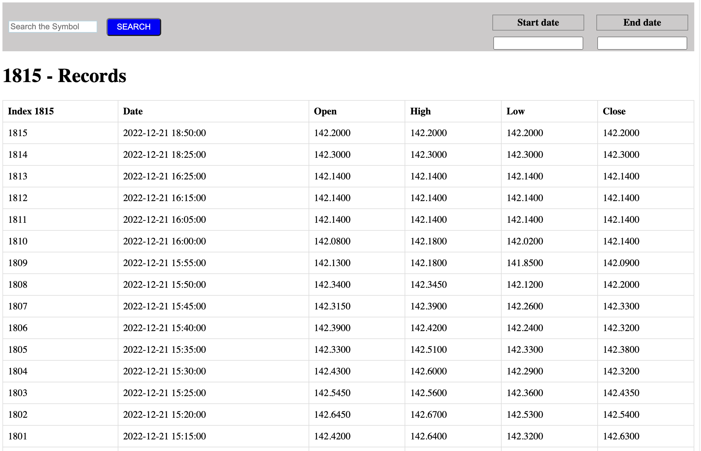

```
https://www.alphavantage.co/query?function=TIME_SERIES_INTRADAY&symbol=IBM&interval=5min&outputsize=full&apikey=demo

```

### Fetch time series data using the above api - DONE

### Display tabular data

### Ability to filter data and chart based on date/time range

### Ability to switch stock symbol



### To run the application

```
npm i
npm run start
```
